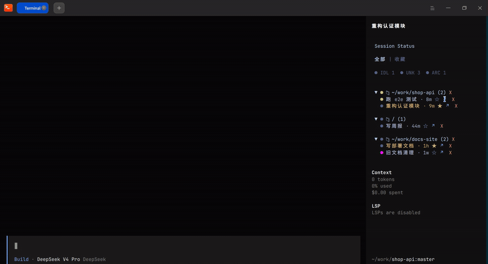
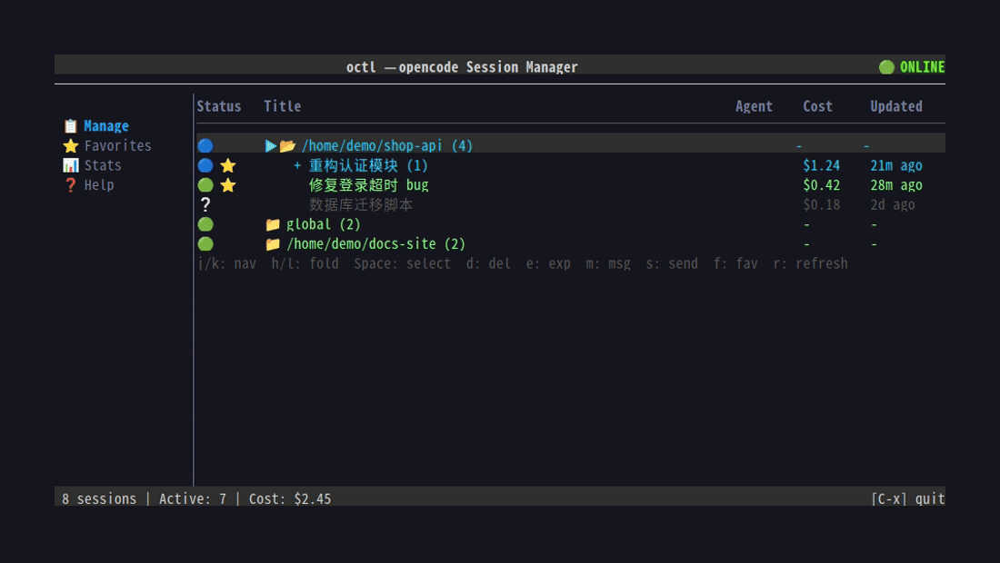

# octl — opencode Session Manager

[English](README.en.md) | 中文

[](https://github.com/tomasWade/octl/actions/workflows/ci.yml)
[](https://go.dev)
[](LICENSE)

A terminal TUI + daemon for browsing and managing your local [opencode](https://opencode.ai) sessions — real-time status, favorites, stats and daily digests. Fully offline; SQLite is only ever opened read-only.

octl 让你在单个终端里总览本机全部 opencode 会话：谁在跑、谁在等权限确认、谁出错了、今天都做了什么。

## ✨ 特性

- **🧩 opencode sidebar 集成（招牌特性）** — 不用离开正在写的对话，opencode TUI 右侧常驻一块实时面板：**全部 project 的 session 树**、聚合状态点（子会话出问题父会话立刻变 🟡）、状态 chip 过滤、两级折叠，全程鼠标操作——点标题收藏（★）、点 ↗ 直接跳到该 session 所在的 tmux pane、点 ✕ 删除。哪个 agent 在等你确认权限，扫一眼就知道
- **终端 TUI 管理台** — project / session 树形视图，多选批量删除 / 导出、收藏（★ 持久化）、新建 / fork / 发消息，全部经 daemon 走 opencode CLI
- **实时状态总览** — BUSY / RETRY / IDLE / PERMISSION / ERROR / ARCHIVED 实时推送；权限等待（🟡）一眼可见，不再有被遗忘的 agent
- **📊 用量统计** — 总 session 数 / 活跃数 / 费用 / Token
- **📅 日报底片** — `octl report` 按需落盘机械事实层（活跃线 + 用户消息骨架），供 skill / agent 做叙事总结（消费方示例：[examples/skills](examples/skills/六耳/SKILL.md)）；被删 session 的全史由影子库保全
- **🔒 安全** — 完全离线；SQLite 以 `?mode=ro` 只读打开；删除走 `opencode session delete`，不直接写库

opencode 内嵌的 sidebar 面板（真实录制——「收藏 / 全部」tab 切换、收藏列表、点击 ↗ 一键跳转到「跑 e2e 测试」所在 的 tmux 窗口）：



独立的终端管理台（`octl`，动图演示）：



## 🚀 快速上手

```bash
go install github.com/tomasWade/octl@latest
octl install                                        # 生成 opencode 插件并注册 sidebar 面板（推荐）
octl --daemon &                                     # 启动守护进程（临时后台，关终端即停；常驻见「让 daemon 常驻」）
octl                                                # 打开 TUI
```

要求：走 `go install` 或源码构建需 Go 1.25+（下载预编译二进制无需 Go）；本机已有 opencode 数据（`~/.local/share/opencode/opencode.db`）。`go install` 会把 `octl` 装到 `$(go env GOPATH)/bin`（通常 `~/go/bin`），请确保该目录在 PATH 中。

没有 Go 环境时，可从 [Releases](https://github.com/tomasWade/octl/releases) 下载预编译二进制（linux/darwin × amd64/arm64），解压后放进 PATH；daemon 常驻见下文「让 daemon 常驻」。

## 💬 示例输出

<details>
<summary><code>octl query snaps</code> — 全部 session 实时状态</summary>

```text
🔵 BUSY  重构认证模块       myproj    13s  abc123def456...
🟢 IDLE  修复登录超时        global    14s  f9964bbacffe...
🟢 IDLE  写周报             global    2m   f8c16b5d2ffe...
🟡 ASK   数据迁移脚本        myproj    5m   f8bc4b454ffe...
⚪ IDLE  Greeting message   global    1h   f8bc40890ffe...
```

</details>

<details>
<summary><code>octl query daily --json</code> — 时间窗口活动聚合（供脚本 / skill 消费）</summary>

```json
{
  "daily": {
    "projects": [
      {
        "name": "myproj",
        "newSessions": [{ "title": "补 e2e 测试", "timeCreated": 1757088000000 }],
        "activeSessions": [
          {
            "title": "重构认证模块",
            "msgCount": 42,
            "firstUserExcerpt": "把认证中间件拆成独立模块，先看现有依赖…",
            "lastAssistantExcerpt": "已完成拆分，全部测试通过…"
          }
        ],
        "archivedSessions": [],
        "sessionCostSum": 1.24
      }
    ],
    "zombies": [],
    "stuckStates": [{ "sessionId": "ses_f8bc4b454", "status": "PERMISSION" }]
  }
}
```

</details>

<details>
<summary><code>octl report</code> — <code>daily/2026-09-05.raw.md</code> 日报底片</summary>

```markdown
<!-- stats: {"from":1757068800000,"to":1757155200000,"projects":1,"active":6,"messages":87} -->
# 2026-09-05

## myproj

### 重构认证模块 (ses_abc123def)
- messages: 42 | window: 09:12–18:40 | cost: $1.24
- 首条: 把认证中间件拆成独立模块，先看现有依赖…
- 末条: 已完成拆分，全部测试通过…

#### 用户消息骨架
- 09:12 把认证中间件拆成独立模块，先看现有依赖
- 10:40 中间件拆完了，补 e2e 测试
- 16:05 CI 挂了一个用例，看一下
```

</details>

## ⚙️ 工作原理

octl 分为 **daemon** 和 **TUI** 两个进程：所有数据读取、状态推导、管理操作都集中在 daemon（唯一数据中心）；TUI 和 sidebar 插件只做渲染，通过 Unix socket 接收 daemon 推送的完整视图数据。

```
opencode 实例 ──hook 插件转发 11 类事件──┐
                                        ▼
SQLite（只读）──▶ octl daemon ──ViewMsg──▶ octl TUI / sidebar 插件
```

## 启动方式

octl 现在分为两个进程：

1. **先启动 daemon**（前台运行，便于 supervisor/systemd 管理）：

   ```bash
   ./octl --daemon
   ```

2. **再启动 TUI**（默认行为）：

   ```bash
   ./octl
   # 或显式
   ./octl --tui
   ```

TUI 启动时会尝试连接 daemon 监听的 Unix socket。如果 daemon 未运行，TUI 不会退出，右上角会显示 `🔴 OFFLINE`，并按指数退避自动重连（250ms 首试，逐级退至 5s 封顶）；恢复后显示 `🟢 ONLINE` 并继续刷新状态。

### 命令行参数

| 参数 | 默认值 | 说明 |
|------|--------|------|
| `--daemon` | `false` | 前台启动 daemon 服务 |
| `--tui` | `false` | 显式启动 TUI（默认） |
| `--version` | `false` | 打印版本号与协议版本 MD5 后退出 |
| `--socket` | `~/.local/share/octl/octl.sock` | Unix socket 路径 |
| `--refresh-time` | `5` | 已废弃；刷新由 daemon 推送驱动，TUI 不再本地轮询 |

另有子命令 `install`（生成 opencode 插件并注册 tui.json）、`query`（一次性查询）和四个动作子命令 `delete` / `create` / `fork` / `send`（见下两节）；旧 `octl plugins --output` 用法已由 `octl install` 取代。

## 命令行查询（octl query）

不打开 TUI，直接向 daemon 发起一次性查询并打印结果，适合脚本或在终端里快速看状态。需要 daemon 正在运行（stdout 只有查询结果，人读信息走 stderr；退出码 `0` 成功 / `1` 运行错误 / `2` 用法错误）。

```bash
octl query snaps                          # 所有 session 实时状态（supervisorctl 风格表格）
octl query sessions                       # project/session 树（含 root 聚合状态）
octl query messages <sessionId>           # 对话内容，sessionId 支持模糊匹配
octl query daily                          # 时间窗口内的活动聚合（默认今天）
```

默认输出人类可读表格（状态彩色圆点 + 状态词、标题、project、相对年龄、去前缀小写 sessionID），`--json` 输出完整 JSON 供 `jq` 等脚本消费：

```bash
octl query snaps --json | jq '.states[] | select(.status=="BUSY")'
```

**模糊匹配**：`messages` 的 sessionId 参数不区分大小写做子串匹配（带不带 `ses_` 前缀均可），唯一命中才执行；多个命中会列出候选，零命中报找不到。

**`--nums` 消息选择器**（仅 messages，默认 `0`）：

| 写法 | 含义 |
|------|------|
| `1` / `2` / … | 第 1、2… 条（从头数） |
| `0` | 最后一条（默认） |
| `-1` / `-2` | 上一条 / 再上一条（从尾数） |
| `3-5`、`4--2`、`-2-6` | 范围；降序写法自动交换为升序 |
| `1,3,-1` | 逗号列表，去重后按时间序输出 |
| `all` | 完整对话 |

超界钳制：正数溢出取最后一条，负数溢出取第一条。

```bash
octl query messages 5v1n --nums all       # 完整对话
octl query messages 5v1n --nums 1,3-5,-1  # 第 1、3~5 条加倒数第 2 条
```

**`daily` 时间窗口聚合**：返回窗口内的事实——按 project 分组的新建/活跃/归档 session（活跃 session 带消息数、首末活动时间和消息摘录）、闲置超 48h 且 30 天内有过活动的僵尸 session、daemon 内存态中卡在 PERMISSION/ERROR 的 session。摘录按名额截断（全局前 100 个活跃 session，用户首条 120 字 / assistant 末条 500 字），JSON 里的 `totalActive`/`excerpted` 标记是否有截断，需要个别 session 全文可再调 `query messages` 补料。窗口语义：缺省为今天（本地时区自然日）；`--date 2026-09-04` 指定单日（与 `--from/--to` 互斥）；`--from` 可单独使用（`--to` 缺省为当前时刻）；时间格式 `2026-09-04` / `2026-09-04T14:00` / `2026-09-04 14:00`。

```bash
octl query daily                          # 今天干了什么
octl query daily --date 2026-09-04        # 某一天
octl query daily --from 2026-09-01        # 9-01 至今（周报窗口）
octl query daily --from 2026-09-01 --to 2026-09-08 --json | jq '.daily.projects[] | {name, active: (.activeSessions | length)}'
```

其他 flags：`--socket <path>` 指定 daemon socket 路径，`--timeout <sec>` 响应超时（默认 5 秒），`octl query` 不带参数显示完整帮助。

## 命令行操作（octl delete / create / fork / send）

不打开 TUI，一次性向 daemon 发送管理 action 并同步等待结果，与 TUI 内的管理操作走同一条 action 协议。需要 daemon 正在运行（stdout 只有操作结果，人读信息走 stderr；退出码 `0` 成功含主动取消 / `1` 运行错误 / `2` 用法错误）。

```bash
octl delete <sessionId>...        # 删除 session（可多个，模糊匹配）
octl create <message>             # 新建 session 并发送首条消息
octl fork <sessionId> <message>   # fork 已有 session 并发送新消息
octl send <sessionId> <message>   # 向已有 session 发送消息
```

```bash
octl delete 5v1n                  # 删除（tty 下先列出目标并要求确认）
octl delete 5v1n --yes            # 跳过确认（脚本友好）
octl delete abc123 def456 --json  # 批量删除，输出 JSON
octl create "修复登录 bug"         # 在当前目录新建 session
octl create "跑测试" --dir ~/code/myproj
octl fork 5v1n "换个思路实现"
octl send 5v1n "继续刚才的任务"
```

行为要点：

- **模糊匹配**：与 `query messages` 相同的不区分大小写子串匹配（带不带 `ses_` 前缀均可），唯一命中才执行；批量删除时全部输入解析成功才执行（任一歧义即整体失败，不会部分删除）。
- **删除确认**：tty 下默认列出目标并要求 `[y/N]` 确认，`--yes` 跳过；非 tty（脚本/管道）直接执行。注意删除为同步操作，批量耗时与数量成正比（`--timeout` 默认 60 秒）。
- **级联删除**：CLI delete 会连带删除目标的全部子 session（action 携带 `cascade=true`，daemon 按 parent 关系展开子树），不会留下孤儿数据。该字段缺省为 false，TUI/sidebar 的删除行为不受影响（dashboard/sidebar 本就在客户端收集全量后代，Favorites 只删选中条目）。
- **目录**：`create` 的 `--dir` 默认当前目录；`fork` / `send` 的 `--dir` 缺省时由 daemon 自动使用该 session 记录的工作目录，无需手动指定。
- **后台执行**：`create` / `fork` / `send` 在 daemon 侧后台启动 `opencode run` 进程后立即返回（result 表示"已启动"而非"已完成"），任务进度用 `octl query snaps` 查看。
- 通用 flags：`--json`、`--socket <path>`、`--timeout <sec>`；各子命令不带参数显示完整帮助。

## 日报底片（octl report）

`octl report` 请求 daemon 生成"底片"（机械事实层）并落盘到 `~/.local/share/octl/daily/`，供日报 skill / agent 做进一步的叙事总结，或供人工回溯消费（一个完整的 skill 消费方示例见 [examples/skills](examples/skills/六耳/SKILL.md)）：

```bash
octl report                          # 今天（覆盖写）
octl report --date 2026-09-04        # 补写某日终版
octl report --from 2026-09-01        # 范围窗口（文件名取起点日期）
```

- **`<date>.raw.md`**：当日活跃 session 的元数据 + 用户消息骨架原文 + 机器可读统计行；整体覆盖（最新即真相）。
- **仅手动触发**：`octl report` 是按需导出 md 的唯一入口，需要底片文件时随时执行。
- **删除不失史**：被删 session 的全史由影子库（`~/.local/share/octl/shadow.db`）持续保全——`octl query messages` 对已删线读影子库全史（带 `[deleted]` 标记），`octl query daily` 口径含被删线；真删除唯一出口是 `octl purge`（默认 180 天保留期）。

## 实时状态守护进程

octl 包含一个独立的守护进程（daemon），通过 Unix socket 接收 opencode 会话的实时状态事件，并作为唯一数据中心向 TUI/sidebar 推送完整视图。

**daemon 需要单独启动**：`octl --daemon`。它监听以下 socket 路径：

```
~/.local/share/octl/octl.sock
```

守护进程会：
1. 启动时全量同步 SQLite 数据库，为每个 session 推断初始状态
2. 每 30 秒定时同步数据库，修正过期或丢失的事件状态
3. 通过 Unix socket 接收 11 类实时事件（session.status、session.idle、session.created、session.deleted、session.error、permission.asked、permission.replied、question.asked、question.replied、question.rejected、session.compacted）
4. 将完整的 `ViewMsg`（projects / sessions / stats / favorites）通过 Unix socket 推送给已订阅的 TUI 和 sidebar 客户端
5. 接收并执行 TUI 发来的管理操作请求（delete / export / create / fork / send / favorite / unfavorite），收藏由 daemon 统一维护并持久化到 `~/.local/share/octl/state.json`（重启恢复）

### 让 daemon 常驻（systemd 用户服务）

仓库附带 systemd 用户服务示例（无需 root）：

```bash
mkdir -p ~/.config/systemd/user
cp scripts/octl.service ~/.config/systemd/user/
systemctl --user daemon-reload
systemctl --user enable --now octl
```

日志：`journalctl --user -u octl -f`。若二进制不在 `~/go/bin`，请修改 unit 文件中的 `ExecStart`。

### 安装 opencode 插件

octl 需要两个 opencode 插件协同工作，一条命令即可完成生成与注册：

```bash
octl install
```

该命令会：

- 生成 `octl-hook.js` 与 `octl-sidebar.tsx` 到 `~/.config/opencode/plugins/`（`--output=<dir>` 可指定其他目录）
- 把 sidebar 注册进 `~/.config/opencode/tui.json` 的 `plugin` 数组（只追加、不替换：已有其他插件条目原样保留；JSON 损坏时报错退出、不覆盖你的文件）

> 插件使用 Bun 运行时（opencode 内置），不依赖任何外部 npm 包。

> 生成的文件头部带有与当前 `octl` 二进制匹配的协议版本常量 `OCTL_PROTOCOL_VERSION`。daemon 启动时会自动把与当前协议一致的插件写入 `~/.config/opencode/plugins/`（内容一致则跳过）；若插件与 daemon 版本不一致，daemon 拒绝订阅并同样自动修复文件，运行中的 opencode 约 1 分钟内热重载新插件并自动重连——升级 octl 只需**替换二进制并重启 daemon**，其余自动。极少数未恢复的情况可重启 opencode 实例或手动运行 `octl install` 对齐。

> tui.json 是机器相关的绝对路径（JSON 不展开 `~`），同步 dotfiles 到新机器时旧 `file://` 条目会失效——在新机器重新执行 `octl install` 即可。若想手动注册，`plugin` 数组必须是 `file://` 绝对路径的条目（把 `<user>` 换成你的用户名）：
>
> ```json
> {
>   "$schema": "https://opencode.ai/tui.json",
>   "plugin": [
>     "file:///home/<user>/.config/opencode/plugins/octl-sidebar.tsx"
>   ]
> }
> ```

### OpenCode Sidebar 集成

两个插件都安装、且 octl daemon 运行后，进入 opencode 的 **session 聊天视图**，右侧 sidebar 会显示 `Session Status` 面板。

面板内容：
- 顶部为「全部」/「收藏」两个 tab 切换栏：project/session 树在「全部」tab 显示，收藏列表在「收藏」tab 显示（不再常驻）；左键点击切换，选中 tab 高亮（`#c0caf5`）、未选中弱化（`#565f89`）
- 每个 project 显示为分组标题：`▶/▼ 📁<worktree 路径> (N)`，其中 N 为该 project 下的 session 总数
- 点击 project 标题行（鼠标左键）可折叠/展开该 project 的 session 列表，标题左侧图标在 ▶（已折叠）与 ▼（已展开）间切换；折叠状态在 daemon 刷新后保持
- 每个 root session 显示状态图标、标题和最后更新时间（如 `🔵 my-session · 2m`）；有 subsession 的 session 标题带 ▶/▼ 图标，左键点击**行首图标**可折叠/展开其子会话列表（点击标题文字不再触发展开）
- 有子节点的 session 默认折叠，仅显示 root 行，折叠标题带直接 subsession 计数（如 `▶ my-session · 2m (3)`）；展开后 subsession 按层级缩进显示并带各自状态图标
- **收藏**：鼠标左键点击 session 标题即可收藏/取消收藏（收藏由 daemon 统一维护并持久化，TUI 与 sidebar 经 daemon 保持一致，重启不丢）；已收藏的 session 标题带 `★` 前缀并以黄色高亮。收藏列表在「收藏」tab 中显示（`★ Favorites`，条目从所有 project 的 sessions 反查标题/状态（状态点复用 `rowStatus` 聚合渲染父项、自身 `status` 渲染叶子，与「全部」树视图一致），已删除 session 自动跳过，点击条目同样可取消收藏）；空收藏时显示 `(no favorites)` 提示
- **删除（X 按钮）**：session 行尾 `★` 之后为 ↗ 跳转按钮、再后为红色 X 删除按钮，左键点击弹出确认浮层（`[确认删除]` / `[取消]`），确认后经 daemon 执行删除——删除 session 会连带其全部子 session，删除 project 会删除其下全部 session 并清理 project 记录；global project 不显示 X、不可删除
- **tmux 跳转（↗ 按钮）**：session 行尾 `★` 与 X 之间为蓝色 ↗ 跳转按钮，「收藏」tab 条目行尾同样有 ↗。点击后：该 session 已附着 tmux 时直接切换到对应 pane；未附着时以 session 标题（清理特殊字符、截 15 字）新建 tmux session（落在该 session 所属目录）并以 TUI 模式 `opencode --session <id>` 打开。需 opencode 在 tmux 内启动（hook 插件上报 pid/tmux 位置，daemon 维护映射并在 opencode 退出后自动失效）
- **hover 高亮**：鼠标悬停 session 标题时标题变色（浅蓝），移开后恢复
- 状态图标代表该 session 树（含所有 subsession）中优先级最高的实时状态（折叠与展开时均显示聚合状态）：

  | 图标 | 状态 | 含义 |
  |------|------|------|
  | 🔴 | ERROR | 有 session 进入错误状态 |
  | 🟡 | ASK | 有 session 等待处理（工具权限确认或 agent 提问） |
  | 🟠 | RETRY | 有 session 正在重试 |
  | 🔵 | BUSY | 有 session AI 正在响应/思考 |
  | ⚪ | IDLE | 等待用户输入 |
  | ◯ | UNKNOWN | 状态不确定（数据库推断） |

- daemon 离线时显示 `offline`；连接失败时显示 `daemon not running` / `daemon not responding`

> 注意：sidebar 只在进入 session 视图后渲染，opencode 首页不显示。

## 视图导航

| 按键 | 视图 | 功能 |
|------|------|------|
| `1` | 📋 **Manage** | 项目+会话树 —— 按 project 组织 session，内置管理操作 |
| `2` | ⭐ **Favorites** | 收藏列表 —— 已收藏的 session（daemon 内存维护） |
| `3` | 📊 **Stats** | 用量统计 —— 全局统计（session 数/活跃数/费用/Token） |
| `Tab` | — | 切换到下一个视图 |
| `Shift+Tab` | — | 切换到上一个视图 |

### 通用操作

| 按键 | 功能 |
|------|------|
| `Ctrl+x` / `Ctrl+C` | 退出 |
| `1`-`3` | 直接跳转到对应视图 |

---

## 各视图说明

### Manage（管理，按 1）

显示项目+会话的树形结构，按 project 分组。

#### 树结构

```
📁 global (12)         ← project 节点（带 session 数）
  ses_xxx...  my-session  architect  $0.05  5m ago  ⚪ IDLE     ← 等待用户输入
    ses_yyy...  subagent   reviewer   $0.01  5m ago  🔵 BUSY    ← AI 正在处理
📁 dbc11090 (0)        ← git 仓库 project（0 个 session）
```

Session 的 **Status** 列显示 daemon 推送的实时状态（需连接 opencode 实例中的 octl-hook.js 插件）。各状态含义：

| 图标 | 状态 | 含义 |
|------|------|------|
| 🔴 | ERROR | session 进入错误状态 |
| 🟡 | ASK | session 等待处理：工具权限确认（bash / 文件写入等）或 agent 提问 |
| 🟠 | RETRY | 错误重试中 |
| 🔵 | BUSY | AI 正在响应 / 思考中 |
| ⚪ | IDLE | 等待用户输入 |
| ◯ | ??? | 状态不确定（数据库推断） |
| &nbsp;&nbsp;— | ARCHIVED | 已归档 |

当 daemon 未运行或插件未安装时，TUI 右上角显示 `🔴 OFFLINE`，状态列不再刷新，但仍显示最后已知状态。

#### 按键操作

| 按键 | 作用 | 有效节点 |
|------|------|----------|
| `j` / `↓` | 向下移动光标 | 全部 |
| `k` / `↑` | 向上移动光标 | 全部 |
| `l` / `→` / `Enter` | 展开节点 | 全部 |
| `h` / `←` | 收起节点 / 跳到父节点 | 全部 |
| `Space` | 多选：session 切换选中，project 全选/反选其全部后代 session | 全部 |
| `d` | 删除：有选中时批量删除全部选中 session；无选中时删除当前子树（project=批量删除其下所有 session；global 只删 session 不删 project） | 全部 |
| `e` | 导出 JSON 到 `/tmp/octl-exports` | 全部（project=批量导出） |
| `m` | 查看对话历史（h/l 翻消息，j/k 滚动，滚动条显示位置） | 仅 session 节点 |
| `n` | 新建 session (project) / fork (session，输入首条消息) | project/session |
| `s` | 发送消息到已有 session | 仅 session 节点 |
| `f` | 收藏切换：多选时切换全部选中 session，否则切换光标处 session（经 daemon 统一维护） | 仅 session 节点 |
| `r` | 提示由 daemon 自动刷新（保留按键兼容） | 全部 |

- 选中行以紫色背景高亮并带 `✓` 前缀；多选状态在刷新后保持。
- 树视图行数超出可视区时显示垂直滚动条（`█` 表示可视窗口、`░` 表示轨道），光标移出可视区自动滚动跟随。
- 对话查看器底部有滚动条，显示当前浏览位置百分比。

### Favorites（收藏，按 2）

显示已收藏的 session 列表，行序与 `ViewMsg` 中 session 的出现顺序一致。支持光标导航、多选、取消收藏和删除。

| 按键 | 作用 |
|------|------|
| `j` / `k` / `↓` / `↑` | 移动光标 |
| `Space` | 多选：切换当前 session 的选中状态 |
| `f` | 取消收藏：多选时移除全部选中 session，否则移除光标处 session |
| `d` | 删除：多选时删除全部选中 session，否则删除光标处 session（同时从收藏中移除） |

- 空收藏时显示提示 `No favorites yet — press f in Manage to favorite a session`。
- 行格式：`状态图标 + 标题`，光标行带 `▶` 前缀，多选行带 `✓` 前缀并以紫色高亮。

> 收藏由 **daemon 统一维护（内存态）**：收藏的权威数据源是 daemon 推送的 `ViewMsg.Favorites` 与每个 session 的 `isFavorite` 字段。TUI 按 `f`、sidebar 点击标题时，前端乐观更新后向 daemon 发送 `favorite` / `unfavorite` action，daemon 执行后重新推送 `ViewMsg` 调和；删除 session 时 daemon 自动剪枝收藏。TUI 与 sidebar 的收藏状态经 daemon 保持一致。收藏不写 opencode 的数据库——持久化走 daemon 自己的 `~/.local/share/octl/state.json`（变更即写 + 周期快照 + 退出 flush，重启恢复），孤儿收藏由既有剪枝机制清理。

### Stats（用量统计，按 3）

展示全局统计数据：总 session 数、活跃 session 数、总费用、总 Token 数。

---

## 数据来源

daemon 读取 opencode 的 SQLite 数据库，路径：

```
~/.local/share/opencode/opencode.db
```

数据库中 octl 使用的表和字段涵盖了 `project`、`session`、`message`、`part` 四张表，查询均为 `SELECT` + 只读。TUI 不再直接连接数据库，所有展示数据来自 daemon 推送的 `ViewMsg`。

## 安全性

| 特性 | 说明 |
|------|------|
| **数据库只读** | daemon 通过 `?mode=ro` 读取，任何 SQL 写入都会在驱动层拒绝 |
| **删除走 CLI** | 不直接写 DB，session 删除通过 `opencode session delete` 执行；daemon 内部统一管理操作 |
| **确认对话框** | 删除/导出操作需确认后才能执行 |
| **无网络访问** | 完全离线，不发送任何数据 |
| **不碰原始文件** | project 删除只清理 DB 记录，不影响 git 仓库和项目文件 |
| **session_diff 清理** | `DeleteSession` 成功后会尽力清理 `~/.local/share/opencode/storage/session_diff/<sessionID>` |

## 构建与插件生成

```bash
# 构建二进制
go build -o octl .

# 生成 opencode 插件（octl-hook.js + octl-sidebar.tsx）并注册 sidebar
octl install
```

插件生成后会自动注入与当前二进制匹配的协议版本常量；升级 octl 时替换二进制并重启 daemon 即可，daemon 会自动对齐插件文件（见上文「安装 opencode 插件」）。

## 测试

```bash
# 所有 Go 单元测试（使用临时 SQLite 数据库，不碰真实数据）
go test ./...

# 插件测试（需要 Bun）
cd plugin && bun install && bun test
```

> 插件测试会从 `internal/plugins/templates/` 导入 TSX 模板，需要仓库根目录有 `node_modules` symlink（指向 `plugin/node_modules`）。全新 clone 后先执行 `ln -sfn plugin/node_modules node_modules`（CI 已内置此步骤）。

## FAQ

**为什么不用 opencode 自带的 session 列表，或多开几个终端？** octl 聚合的是*全部 project* 的实时状态——哪些 agent 卡在权限确认、哪些出错了、闲置了多久——并提供批量管理、用量统计和日报底片；多开终端看不到全局，也没有历史回溯。octl 不侵入 opencode 本体（只读 DB + CLI 删除），两者可以并用。

## 已知限制

- TUI 必须连接 daemon 才能浏览数据；daemon 离线时仅显示离线提示，不再提供静态离线浏览。
- `--refresh-time` 参数已保留但不再生效，刷新完全由 daemon 推送驱动。
